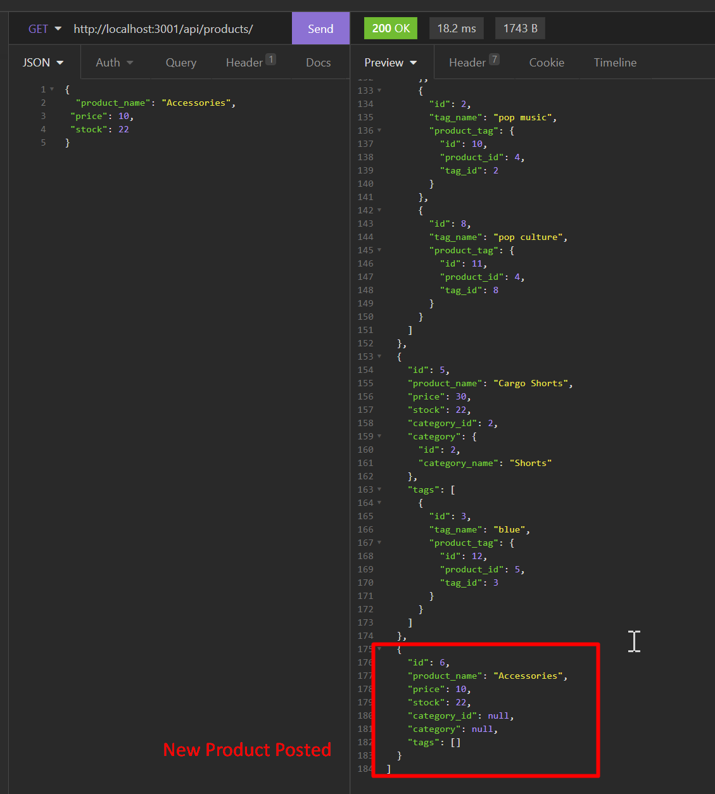

# 13-ObjectRelationalMapping-eCommerceBackEnd_usingExpress.jsMySQLAndSequelize


## Task
Build the back end for an e-commerce site by modifying starter code to configure a working Express.js API to use Sequelize to interact with a MySQL database.

Internet retail, also known as **e-commerce**, is the largest sector of the electronics industry, generating an estimated $29 trillion in 2019. E-commerce platforms like Shopify and WooCommerce provide a suite of services to businesses of all sizes. Due to their prevalence, understanding the fundamental architecture of these platforms will benefit any full-stack web developer.


## User Story

```
AS A manager at an internet retail company
I WANT a back end for my e-commerce website that uses the latest technologies
SO THAT my company can compete with other e-commerce companies
```

## Acceptance Criteria

```
GIVEN a functional Express.js API
✓ WHEN I add my database name, MySQL username, and MySQL password to an environment variable file THEN I am able to connect to a database using Sequelize
✓ WHEN I enter schema and seed commands THEN a development database is created and is seeded with test data
✓ WHEN I enter the command to invoke the application THEN my server is started and the Sequelize models are synced to the MySQL database
✓ WHEN I open API GET routes in Insomnia Core for categories, products, or tags THEN the data for each of these routes is displayed in a formatted JSON
✓ WHEN I test API POST, PUT, and DELETE routes in Insomnia Core THEN I am able to successfully create, update, and delete data in my database
```

## DNB's SOLUTION:
#### UNC Boot Camp Submission: 
🗂️ [Github Repository](https://github.com/DionneNoellaBarretto/13-ObjectRelationalMapping-eCommerceBackEnd_usingExpress.jsMySQLAndSequelize)

📰[Github Page](https://dionnenoellabarretto.github.io/13-ObjectRelationalMapping-eCommerceBackEnd_usingExpress.jsMySQLAndSequelize/)

🎥 [Demonstration Video Link - Demonstration](https://drive.google.com/file/d/1sb-64L05qkHnmef4r63L3pS5Fher6w-9/view?usp=sharing) 
🎞️ [Gif Demonstartion](./Assets/13-ObjectRelationalMapping-eCommerceBackEnd_usingExpress.jsMySQLAndSequelize.gif)
🎞️ [Gif Demo1](./Assets/13-orm-homework-demo-01.gif)
🎞️ [Gif Demo2](./Assets/13-orm-homework-demo-02.gif)
🎞️ [Gif Demo3](./Assets/13-orm-homework-demo-03.gif)

## Usage Instructions

Use the [MySQL2](https://www.npmjs.com/package/mysql2) and [Sequelize](https://www.npmjs.com/package/sequelize) packages to connect Express.js API to a MySQL database and the [dotenv](https://www.npmjs.com/package/dotenv) package to use environment variables to store sensitive data.

Use the `schema.sql` file in the `db` folder to create a database with MySQL shell commands & use environment variables to store sensitive data like MySQL username, password, and database name.

## Application Functionality Screenshots

The following images show the web application's appearance and functionality:
**All Gets (Product, Category,Tags with id1 highlighted for each)**: 


**Product ID1**:

**Tag ID 2**:

**Example Get Category ID 4**:

**Example Post New Category**:
.png)
**Example Get Category ID 6/ DB Value for 6**:
.png)
**Example Put Category ID 6/ DB value for 6**:

**Example of Updated Get Category ID 6/ DB Value for 6**:

**Example Delete Category ID 6/ DB Value for 6**:

**Example Error for non existent Tag ID 9/ DB Value for 9**:

**Example New Product Posted**:

**Error Example for missing required information in json**:

**Example new Tag ID posted**:

**Error Example for wrong url**:


## Grading Requirements

This homework is graded based on the following criteria: 

### Deliverables: 10%

```
✅ The GitHub repository containing your application code.
```

### Walkthrough Video: 37%
```
✅ A walkthrough video that demonstrates the functionality of the e-commerce back end must be submitted, and a link to the video should be included in your readme file.
✅ The walkthrough video must show all of the technical acceptance criteria being met.
✅ The walkthrough video must demonstrate how to create the schema from the MySQL shell.
✅ The walkthrough video must demonstrate how to seed the database from the command line.
✅ The walkthrough video must demonstrate how to start the application’s server.
✅ The walkthrough video must demonstrate GET routes for all categories, all products, and all tags being tested in Insomnia Core.
✅ The walkthrough video must demonstrate GET routes for a single category, a single product, and a single tag being tested in Insomnia Core.
✅ The walkthrough video must demonstrate POST, PUT, and DELETE routes for categories, products, and tags being tested in Insomnia Core.
```

### Technical Acceptance Criteria: 40%

* Satisfies all of the preceding acceptance criteria plus the following:
```
  ✅ Connects to a MySQL database using the [MySQL2](https://www.npmjs.com/package/mysql) and [Sequelize](https://www.npmjs.com/package/sequelize) packages.
  ✅ Stores sensitive data, like a user’s MySQL username, password, and database name, using environment variables through the [dotenv](https://www.npmjs.com/package/dotenv) package.
  ✅ Syncs Sequelize models to a MySQL database on the server start.
  ✅ Includes column definitions for all four models outlined in the homework instructions.
  ✅ Includes model associations outlined in the homework instructions.
```

### Repository Quality: 13%
```
✅ Repository has a unique name.
✅ Repository follows best practices for file structure and naming conventions.
✅ Repository follows best practices for class/id naming conventions, indentation, quality comments, etc.
✅ Repository contains multiple descriptive commit messages.
✅ Repository contains quality README file with description, screenshot, and link to deployed application.
```
